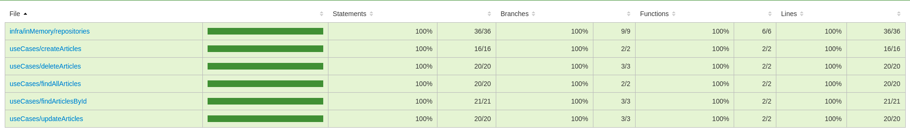

# Back-end Challenge 🏅 2021 - Space Flight News - Coodesh

## 📝 Sobre

Esse projeto tem como objetivo o construir uma API (CRUD), baseada na API da
[Space Flight News](https://api.spaceflightnewsapi.net/v3/documentation),
utilizando melhores praticas de programação.

> Video de apresentação: [https://youtu.be/j9gSlV20ghc](https://youtu.be/j9gSlV20ghc)

> This is a challenge by [Coodesh](https://coodesh.com/)

## 🛠 Tech

- [Node.js](https://nodejs.org/en/)
- [Typescript](https://www.typescriptlang.org/)
- [Express](http://expressjs.com/)
- [MongoDB](https://www.mongodb.com/)
- [Node-schedule](https://www.npmjs.com/package/node-schedule)

---

- [Jest](https://jestjs.io/pt-BR/)
- [Swagger](https://swagger.io/)
- [Celebrate](https://www.npmjs.com/package/celebrate)

---

- [Helmet](https://www.npmjs.com/package/helmet)
- [Cors](https://www.npmjs.com/package/cors)
- [Sentry](https://sentry.io/welcome/)
- [ioRedis](https://www.npmjs.com/package/ioredis)
- [rate-limiter-flexible](https://www.npmjs.com/package/rate-limiter-flexible)

---

- [Axios](https://www.npmjs.com/package/axios)
- [date-fns](https://www.npmjs.com/package/date-fns)

---

- [Docker](https://www.docker.com/)
- [SWC](https://swc.rs/)

---

## 🚦 Cobertura de teste unitarios



## ⚙️ Executando

```bash
$ git clone https://github.com/DenisMedeirosSDK/space-flight-news.git

$ cd space-flight-news

$ touch .env
```

Crie um projeto no [Sentry](https://sentry.io/welcome/), com o projeto criado pegue a credencial de DSN.

No arquivo `.env` devem ser definidas as variaveis que estão dentro de `.env.example`:

### Sem Docker

- `MONGO_URL`:

**atlas**: `mongodb+srv://<username>:<password>@<host>/coodesh`

**localhost**: `mongodb://localhost:27017/coodesh`

- `REDIS_HOST`: `localhost` || `127.0.0.1`

```bash
$ npm install

$ npm run start:dev
```

### Docker

- `MONGO_URL`: `mongodb://root:root@db/coodesh?authSource=admin`

- `REDIS_HOST`: `redis`

```bash
$ docker-compose up -d
```

Para ver os dados do MongoDB acesse: [http://localhost:8081/](http://localhost:8081/)

### Endpoint da documentação

[http://localhost:3000/api-docs](http://localhost:3000/api-docs)
